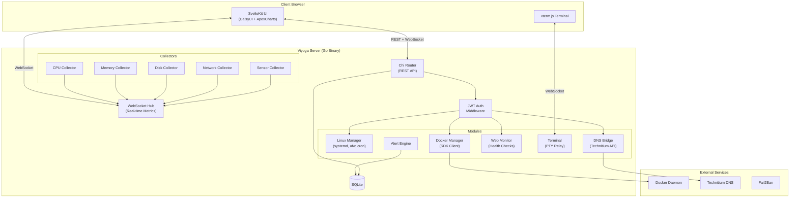

# Viyoga — Self-Hosted Ubuntu Server Dashboard

A lightweight, modular, open-source Linux server operations dashboard for Ubuntu Server — serving solo developers, homelab admins, and small teams.

## Background

Viyoga unifies real-time hardware monitoring, Linux system management, DNS-based network security (Pi-hole style), Docker container management, and web service monitoring into a single, privacy-respecting web UI. It targets Ubuntu Server 22.04/24.04 LTS with an idle memory footprint under 150MB.

**Competitive landscape:** Projects like Beszel, Cockpit, and HestiaCP cover parts of this space, but none combine all modules (DNS gateway + container management + system monitoring + terminal) in a single lightweight package. Viyoga fills that gap.

---

## User Review Required

> [!IMPORTANT]
> **Monorepo vs. Separate Repos:** This plan uses a monorepo structure (`apps/backend` + `apps/frontend`). If you prefer separate Git repos, I can adjust.

> [!IMPORTANT]
> **DNS Engine Choice:** The plan assumes **Technitium DNS Server** as the DNS gateway engine (more powerful than Pi-hole, supports DoH/DoT natively). If you prefer Pi-hole, the integration layer will differ. Please confirm.

> [!IMPORTANT]
> **Phase 1 Scope:** The plan starts with the **System Dashboard + Go Agent** as Phase 1 (the foundation everything else builds on). Please confirm this prioritization makes sense for you.

> [!WARNING]
> **Development Environment:** This plan is designed to be developed and tested on an Ubuntu Server. Since your current environment is Windows, we'll use Docker for local development and testing. The Go agent's `/proc` and `/sys` parsing will require a Linux environment. Please confirm you have Docker Desktop or WSL2 available.

---

## Open Questions

1. **Branding:** Do you have a logo, color palette, or design mockups for Viyoga? If not, I'll create a dark-themed design system with a cyberpunk/terminal aesthetic.
2. **Auth Scope (Phase 1):** Should Phase 1 include JWT auth, or should we start with an open dashboard and add auth in a later phase?
3. **InfluxDB:** Should we include InfluxDB from the start for time-series metrics, or start with SQLite-only and add InfluxDB as an optional module later?
4. **Multi-server:** The spec mentions multi-server SSH fleet view. Should this be part of the initial architecture, or a future extension?
5. **Alerts:** Webhook vs. Telegram vs. Email — which notification channels do you want first?

---

## Proposed Project Structure

```
viyoga/
├── apps/
│   ├── backend/                    # Go backend (single binary)
│   │   ├── cmd/
│   │   │   └── viyoga/
│   │   │       └── main.go         # Entry point
│   │   ├── internal/
│   │   │   ├── config/             # YAML config loader
│   │   │   │   └── config.go
│   │   │   ├── collector/          # System metric collectors
│   │   │   │   ├── cpu.go
│   │   │   │   ├── memory.go
│   │   │   │   ├── disk.go
│   │   │   │   ├── network.go
│   │   │   │   ├── sensors.go      # lm-sensors / hwmon
│   │   │   │   └── process.go
│   │   │   ├── docker/             # Docker SDK integration
│   │   │   │   ├── client.go
│   │   │   │   ├── containers.go
│   │   │   │   └── images.go
│   │   │   ├── dns/                # DNS gateway bridge
│   │   │   │   ├── technitium.go
│   │   │   │   └── blocklist.go
│   │   │   ├── linux/              # Linux management
│   │   │   │   ├── systemd.go
│   │   │   │   ├── users.go
│   │   │   │   ├── firewall.go     # UFW wrapper
│   │   │   │   ├── logs.go         # journalctl wrapper
│   │   │   │   └── cron.go
│   │   │   ├── monitor/            # Web service monitor
│   │   │   │   ├── healthcheck.go
│   │   │   │   └── uptime.go
│   │   │   ├── security/           # Auth, Fail2Ban, SSL
│   │   │   │   ├── auth.go
│   │   │   │   ├── jwt.go
│   │   │   │   ├── fail2ban.go
│   │   │   │   └── ssl.go
│   │   │   ├── terminal/           # PTY + WebSocket relay
│   │   │   │   └── pty.go
│   │   │   ├── alerting/           # Threshold alerts + webhooks
│   │   │   │   ├── engine.go
│   │   │   │   └── notifier.go
│   │   │   ├── store/              # Database layer
│   │   │   │   ├── sqlite.go
│   │   │   │   └── migrations.go
│   │   │   ├── hub/                # WebSocket hub (broadcast)
│   │   │   │   └── hub.go
│   │   │   └── api/                # HTTP handlers + router
│   │   │       ├── router.go
│   │   │       ├── middleware.go
│   │   │       ├── metrics.go
│   │   │       ├── docker.go
│   │   │       ├── dns.go
│   │   │       ├── linux.go
│   │   │       ├── monitor.go
│   │   │       ├── terminal.go
│   │   │       └── auth.go
│   │   ├── go.mod
│   │   ├── go.sum
│   │   └── Makefile
│   │
│   └── frontend/                   # SvelteKit application
│       ├── src/
│       │   ├── lib/
│       │   │   ├── components/     # Reusable UI components
│       │   │   │   ├── charts/     # ApexCharts wrappers
│       │   │   │   ├── layout/     # Sidebar, Header, etc.
│       │   │   │   ├── metrics/    # Gauge, StatCard, etc.
│       │   │   │   ├── terminal/   # xterm.js wrapper
│       │   │   │   └── common/     # Button, Modal, Badge, etc.
│       │   │   ├── stores/         # Svelte stores (state)
│       │   │   │   ├── metrics.ts
│       │   │   │   ├── docker.ts
│       │   │   │   ├── dns.ts
│       │   │   │   └── auth.ts
│       │   │   ├── api/            # API client functions
│       │   │   │   └── client.ts
│       │   │   ├── types/          # TypeScript interfaces
│       │   │   │   └── index.ts
│       │   │   └── utils/          # Helpers, formatters
│       │   │       └── index.ts
│       │   ├── routes/
│       │   │   ├── +layout.svelte  # Root layout (sidebar + nav)
│       │   │   ├── +page.svelte    # Dashboard home
│       │   │   ├── system/         # Linux management pages
│       │   │   ├── hardware/       # Hardware monitor pages
│       │   │   ├── docker/         # Container management
│       │   │   ├── dns/            # DNS gateway pages
│       │   │   ├── monitor/        # Web service monitor
│       │   │   ├── terminal/       # In-browser terminal
│       │   │   ├── security/       # Security settings
│       │   │   └── settings/       # App settings
│       │   └── app.html
│       ├── static/
│       ├── package.json
│       ├── svelte.config.js
│       ├── tailwind.config.js      # DaisyUI theme config
│       └── vite.config.ts
│
├── deploy/                         # Deployment configs
│   ├── docker-compose.yml          # Full stack compose
│   ├── docker-compose.dev.yml      # Dev overrides
│   ├── Dockerfile.backend
│   ├── Dockerfile.frontend
│   └── install.sh                  # Single-command installer
│
├── configs/                        # Default config templates
│   └── viyoga.example.yaml
│
├── docs/                           # Documentation
│   ├── architecture.md
│   ├── api-reference.md
│   └── modules.md
│
├── scripts/                        # Build & dev scripts
│   ├── dev.sh
│   └── build.sh
│
├── .github/
│   └── workflows/
│       └── ci.yml
│
├── LICENSE                         # MIT or Apache-2.0
├── README.md
└── .gitignore
```

---

## Proposed Changes — Phased Delivery

### Phase 1: Foundation — System Dashboard + Go Agent ⭐
> **Goal:** A working dashboard with real-time CPU, RAM, Disk, Network metrics.
> **Estimated effort:** ~3-4 days

---

#### Backend (Go)

##### [NEW] `apps/backend/cmd/viyoga/main.go`
- Entry point: load config, initialize collectors, start HTTP server + WebSocket hub
- Graceful shutdown handling

##### [NEW] `apps/backend/internal/config/config.go`
- YAML config loader using `gopkg.in/yaml.v3`
- Defines `Config` struct: server port, enabled modules, polling intervals, DB path

##### [NEW] `apps/backend/internal/collector/*.go`
- **cpu.go** — Parse `/proc/stat` for CPU utilization per-core and aggregate
- **memory.go** — Parse `/proc/meminfo` for RAM/swap usage
- **disk.go** — Parse `/proc/diskstats` + `syscall.Statfs` for disk I/O and space
- **network.go** — Parse `/proc/net/dev` for per-interface TX/RX bytes/packets
- All collectors implement a `Collector` interface:
  ```go
  type Collector interface {
      Collect(ctx context.Context) (interface{}, error)
      Name() string
  }
  ```
- A `Manager` runs all collectors on a configurable tick interval (default 2s) and pushes results to a channel

##### [NEW] `apps/backend/internal/hub/hub.go`
- WebSocket hub using `gorilla/websocket`
- Broker pattern: maintains a set of connected clients
- Receives metrics from collector manager via channel, broadcasts JSON to all clients
- Handles client connect/disconnect gracefully with ping/pong heartbeat

##### [NEW] `apps/backend/internal/api/router.go`
- Chi router with middleware (CORS, logging, recovery)
- REST endpoints:
  - `GET /api/v1/metrics/current` — Snapshot of all current metrics
  - `GET /api/v1/metrics/cpu` — CPU details
  - `GET /api/v1/metrics/memory` — Memory details
  - `GET /api/v1/metrics/disk` — Disk details
  - `GET /api/v1/metrics/network` — Network details
  - `GET /ws/metrics` — WebSocket stream for real-time metrics
- Static file serving for SvelteKit build output

##### [NEW] `apps/backend/internal/store/sqlite.go`
- SQLite via `modernc.org/sqlite` (pure Go, no CGO)
- Schema: `metrics_history` table for basic time-series storage
- Auto-cleanup of data older than configurable retention period (default 24h)

##### Key Go dependencies:
| Package | Purpose |
|---|---|
| `go-chi/chi/v5` | HTTP router |
| `gorilla/websocket` | WebSocket server |
| `shirou/gopsutil/v3` | Cross-platform system metrics (fallback) |
| `modernc.org/sqlite` | Embedded SQLite (pure Go) |
| `gopkg.in/yaml.v3` | Config file parsing |
| `rs/zerolog` | Structured logging |

---

#### Frontend (SvelteKit)

##### [NEW] `apps/frontend/` — SvelteKit project scaffold
- Created with `npx sv create` (Svelte 5, TypeScript, DaisyUI)
- Dark mode by default with cyberpunk/terminal color theme
- Responsive sidebar layout

##### [NEW] Core components:
- **`Sidebar.svelte`** — Navigation with module icons, collapsible
- **`Header.svelte`** — Server hostname, uptime, quick actions
- **`StatCard.svelte`** — Animated metric card with sparkline
- **`GaugeChart.svelte`** — Circular CPU/RAM gauge
- **`AreaChart.svelte`** — Real-time time-series chart (ApexCharts)
- **`MetricGrid.svelte`** — Responsive grid layout for metric cards

##### [NEW] Dashboard page (`/`):
- 4 main gauges: CPU, RAM, Disk, Network
- Real-time charts with 60-second rolling window
- System info panel (hostname, OS, kernel, uptime)
- WebSocket connection with auto-reconnect

##### Design system (DaisyUI theme):
```js
// tailwind.config.js
daisyui: {
  themes: [{
    viyoga: {
      "primary": "#00d4ff",      // Cyan
      "secondary": "#7c3aed",    // Purple
      "accent": "#22d3ee",       // Teal
      "neutral": "#1e1e2e",      // Dark bg
      "base-100": "#0f0f1a",     // Deepest bg
      "base-200": "#1a1a2e",     // Card bg
      "base-300": "#252542",     // Elevated bg
      "info": "#3b82f6",
      "success": "#22c55e",
      "warning": "#f59e0b",
      "error": "#ef4444",
    }
  }]
}
```

---

### Phase 2: Linux Management
> **Goal:** Systemd service management, user management, journalctl log viewer, cron editor, UFW firewall rules.

- **Backend:** `internal/linux/` module — wrappers around `systemctl`, `journalctl`, `ufw`, `useradd/userdel`, `crontab`
- **Frontend:** `/system/` routes — services table with start/stop/restart, log viewer with search/filter, user management CRUD, cron job editor, firewall rules table
- Execute commands via `os/exec` with proper input sanitization

---

### Phase 3: Hardware Monitor + Alerting
> **Goal:** Temperature/fan sensors, process tree, threshold alerts with webhook notifications.

- **Backend:** `internal/collector/sensors.go` — parse `/sys/class/hwmon/` and `lm-sensors` output; `internal/alerting/` — configurable thresholds with webhook/Telegram notifier
- **Frontend:** `/hardware/` routes — sensor dashboard, process tree (sortable by CPU/RAM), alert configuration UI

---

### Phase 4: Container Manager (Docker)
> **Goal:** Full Docker container lifecycle from the UI.

- **Backend:** `internal/docker/` — Docker SDK client for list/create/start/stop/remove containers, pull/remove images, container logs streaming, port mapping display
- **Frontend:** `/docker/` routes — container list with status badges, create container wizard, image management, log viewer with follow mode, compose file editor

---

### Phase 5: DNS Gateway
> **Goal:** Network-level ad/tracker blocking, DNS query logs, DHCP management.

- **Backend:** `internal/dns/` — REST API bridge to Technitium DNS Server API, blocklist management, query log aggregation
- **Frontend:** `/dns/` routes — blocked queries dashboard, blocklist management, DNS query log with search, DHCP leases viewer
- **Deploy:** Technitium DNS as a Docker service in the compose stack

---

### Phase 6: Terminal, Security, Web Monitor
> **Goal:** In-browser shell, JWT auth, Fail2Ban status, SSL management, HTTP endpoint monitoring.

- **Terminal:** `internal/terminal/pty.go` — PTY spawning + WebSocket relay; frontend xterm.js integration
- **Security:** JWT auth middleware, bcrypt password hashing, Fail2Ban status parsing, Let's Encrypt integration
- **Web Monitor:** `internal/monitor/` — configurable HTTP health checks with cron-style scheduling, response time tracking

---

## Architecture Diagram



---

## Real-Time Data Strategy

| Channel | Protocol | Use Case |
|---|---|---|
| System metrics | WebSocket | CPU, RAM, Disk, Network — pushed every 2s |
| Container stats | WebSocket | Docker container resource usage |
| Terminal | WebSocket | Bidirectional PTY I/O |
| DNS query log | SSE | Unidirectional live query feed |
| Alerts | WebSocket | Real-time alert notifications |
| REST endpoints | HTTP | Configuration CRUD, historical data queries |

---

## Database Schema (SQLite — Phase 1)

```sql
-- System metrics history (time-series, auto-pruned)
CREATE TABLE metrics_history (
    id INTEGER PRIMARY KEY AUTOINCREMENT,
    timestamp DATETIME DEFAULT CURRENT_TIMESTAMP,
    metric_type TEXT NOT NULL,          -- 'cpu', 'memory', 'disk', 'network'
    metric_data JSON NOT NULL,          -- Full metric snapshot as JSON
    created_at DATETIME DEFAULT CURRENT_TIMESTAMP
);
CREATE INDEX idx_metrics_ts ON metrics_history(timestamp, metric_type);

-- Alert rules
CREATE TABLE alert_rules (
    id INTEGER PRIMARY KEY AUTOINCREMENT,
    name TEXT NOT NULL,
    metric_type TEXT NOT NULL,
    condition TEXT NOT NULL,            -- 'gt', 'lt', 'eq'
    threshold REAL NOT NULL,
    notify_channel TEXT DEFAULT 'webhook',
    notify_target TEXT,
    enabled BOOLEAN DEFAULT 1,
    created_at DATETIME DEFAULT CURRENT_TIMESTAMP
);

-- Alert history
CREATE TABLE alert_events (
    id INTEGER PRIMARY KEY AUTOINCREMENT,
    rule_id INTEGER REFERENCES alert_rules(id),
    triggered_at DATETIME DEFAULT CURRENT_TIMESTAMP,
    value REAL,
    resolved_at DATETIME,
    acknowledged BOOLEAN DEFAULT 0
);

-- Users (for auth)
CREATE TABLE users (
    id INTEGER PRIMARY KEY AUTOINCREMENT,
    username TEXT UNIQUE NOT NULL,
    password_hash TEXT NOT NULL,
    role TEXT DEFAULT 'viewer',         -- 'admin', 'viewer'
    created_at DATETIME DEFAULT CURRENT_TIMESTAMP
);

-- Web monitor targets
CREATE TABLE monitor_targets (
    id INTEGER PRIMARY KEY AUTOINCREMENT,
    name TEXT NOT NULL,
    url TEXT NOT NULL,
    method TEXT DEFAULT 'GET',
    interval_seconds INTEGER DEFAULT 60,
    timeout_seconds INTEGER DEFAULT 10,
    expected_status INTEGER DEFAULT 200,
    enabled BOOLEAN DEFAULT 1,
    created_at DATETIME DEFAULT CURRENT_TIMESTAMP
);

-- Monitor results
CREATE TABLE monitor_results (
    id INTEGER PRIMARY KEY AUTOINCREMENT,
    target_id INTEGER REFERENCES monitor_targets(id),
    status_code INTEGER,
    response_time_ms INTEGER,
    is_up BOOLEAN,
    error_message TEXT,
    checked_at DATETIME DEFAULT CURRENT_TIMESTAMP
);
CREATE INDEX idx_monitor_results ON monitor_results(target_id, checked_at);
```

---

## Config File (`viyoga.yaml`)

```yaml
server:
  host: "0.0.0.0"
  port: 8080
  frontend_dir: "./frontend/build"  # Path to SvelteKit build

modules:
  system_dashboard: true
  linux_management: true
  hardware_monitor: true
  dns_gateway: false          # Requires Technitium DNS
  container_manager: true     # Requires Docker
  web_monitor: true
  terminal: true
  security: true

metrics:
  poll_interval: "2s"
  retention_hours: 24
  history_enabled: true

database:
  path: "./data/viyoga.db"

auth:
  enabled: false              # Set true to require login
  jwt_secret: ""              # Auto-generated if empty
  session_hours: 24

docker:
  socket: "unix:///var/run/docker.sock"

dns:
  engine: "technitium"
  api_url: "http://localhost:5380"
  api_token: ""

alerting:
  enabled: false
  channels:
    - type: webhook
      url: ""
    - type: telegram
      bot_token: ""
      chat_id: ""

logging:
  level: "info"               # debug, info, warn, error
  format: "json"              # json, console
```

---

## Deployment Strategy

### Development (Docker Compose)
```yaml
# docker-compose.dev.yml
services:
  backend:
    build:
      context: ./apps/backend
      dockerfile: ../../deploy/Dockerfile.backend
    ports:
      - "8080:8080"
    volumes:
      - ./apps/backend:/app
      - /proc:/host/proc:ro
      - /sys:/host/sys:ro
      - /var/run/docker.sock:/var/run/docker.sock
    environment:
      - VIYOGA_ENV=development

  frontend:
    build:
      context: ./apps/frontend
    ports:
      - "5173:5173"
    volumes:
      - ./apps/frontend:/app
      - /app/node_modules
    command: npm run dev -- --host
```

### Production
- Go backend serves SvelteKit static build (adapter-static)
- Single Docker image with multi-stage build
- `curl -sSL https://viyoga.sh/install | bash` installer script

---

## Verification Plan

### Automated Tests
- **Backend:** Go unit tests for each collector (mock `/proc` files), API handler tests with `httptest`
- **Frontend:** Component tests with Vitest + Svelte Testing Library
- **Integration:** Docker Compose spin-up test — verify API responds, WebSocket connects, metrics flow

### Manual Verification
- Spin up the dev compose stack
- Open browser at `http://localhost:5173`
- Verify real-time metric charts update every 2 seconds
- Verify system info panel shows correct hostname/OS
- Test responsive layout on mobile viewport

### Build Verification
```bash
# Backend
cd apps/backend && go build -o viyoga ./cmd/viyoga/
./viyoga --version

# Frontend
cd apps/frontend && npm run build
ls -la build/

# Full stack
docker compose -f deploy/docker-compose.yml build
docker compose -f deploy/docker-compose.yml up -d
curl http://localhost:8080/api/v1/metrics/current
```
